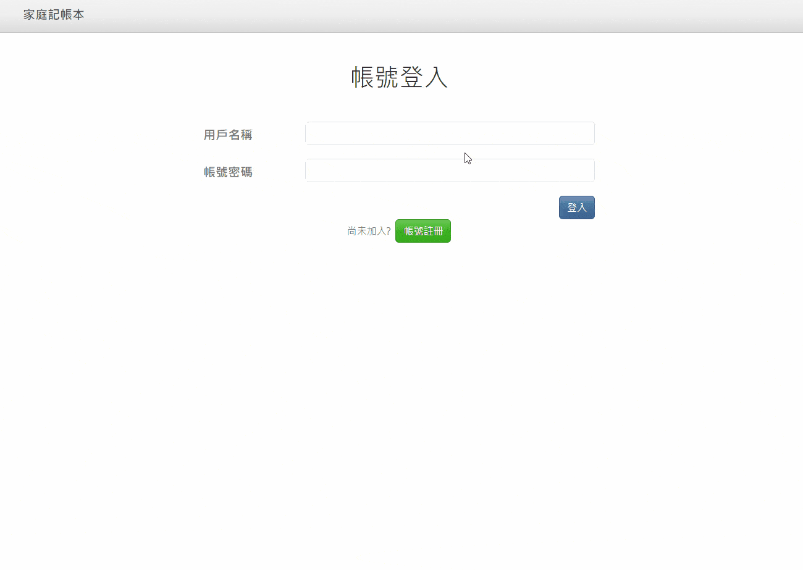

<a name="readme-top"></a>

<!-- PROJECT LOGO -->
<div align="center">
  <a href="https://github.com/CYW-Allen/restaurant-list">
    
  </a>

  <h1 align="center">Expense Tracker</h1>
  <h3 align="center">An app for recording sorts of expenses in daily live.</h3>
</div>


<!-- TABLE OF CONTENTS -->
<details>
  <summary>Table of Contents</summary>
  <ol>
    <li>
      <a href="#about-the-project">About The Project</a>
      <ul>
        <li><a href="#main-function">Main Function</a></li>
        <li><a href="#additional-modifications">Additional Modifications</a></li>
        <li><a href="#built-with">Built With</a></li>
      </ul>
    </li>
    <li>
      <a href="#getting-started">Getting Started</a>
    </li>
    <li><a href="#extra-resources">Extra resources</a></li>
  </ol>
</details>


<!-- ABOUT THE PROJECT -->
## About The Project

<div align="center">
  
</div>

### Main Function
* User login and register.
* CRUD operations for the user's expense records.
* View the records based on kinds of category.


### Additional features
* Use virtual scroll for large number of records.
* Sort the records by name, date, category or expense amount.
* Filter the records by keyword and specific period.
* Use charts to present user's expense statistics (daily and overview).
* Status prompt popup (auto closing).

### Built With

* [![Express][Express.js]][Express-url]
* [![Bootswatch][Bootswatch.com]][Bootswatch-url]

<p align="right">(<a href="#readme-top">back to top</a>)</p>


<!-- GETTING STARTED -->
## Getting Started

### Installation

1. Clone the repo
   ```sh
   git clone https://github.com/CYW-Allen/expense-tracker.git
   ```
2. Install NPM packages
   ```sh
   npm install
   ```
3. Check .env.example file to set the app required env vars in .env file
4. Initiate mysql service 
5. Initialize the database 
   ```sh
   npm run initdb
   ```
6. Insert some seed data
   ```sh
   npm run seed
   ```

After above steps, now you can run the app by the following command.
  ```sh
  npm start
  ```

<p align="right">(<a href="#readme-top">back to top</a>)</p>

<!-- MARKDOWN LINKS & IMAGES -->
<!-- https://www.markdownguide.org/basic-syntax/#reference-style-links -->
[Express.js]: https://img.shields.io/badge/Express.js-rgb(194%2C%20234%2C%20255)?style=for-the-badge&logo=nodedotjs&logoColor=green
[Express-url]: https://expressjs.com/
[Bootswatch.com]: https://img.shields.io/badge/Bootswatch-563D7C?style=for-the-badge&logo=bootstrap&logoColor=white
[Bootswatch-url]: https://bootswatch.com/spacelab/
